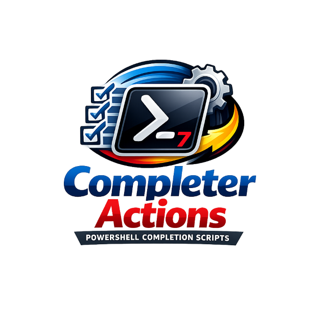

# CompleterActions

<p align="center">
    
</p>

<p align="center"><strong>PowerShell completion scripts for managed registrations, runtime discovery, and safe removal.</strong></p>

<p align="center">
    <a href="https://learn.microsoft.com/powershell/"></a>
    <a href="https://learn.microsoft.com/powershell/scripting/install/powershell-core-support"></a>
    <a href="LICENSE.md"></a>
</p>

`CompleterActions` is a PowerShell 7+ / Core-only module for registering, discovering, querying, and removing PowerShell argument completers in a consistent way.

> [!IMPORTANT]
> This module targets **PowerShell 7+ / PowerShell Core only**. The manifest declares `CompatiblePSEditions = @('Core')` and `PowerShellVersion = '7.0'`.

## At a glance

- Manage both parameter completers and native command completers
- Import supported completer scripts into managed registration input objects
- Query module-managed registrations and runtime-discovered registrations
- Remove managed registrations cleanly from both runtime and module state
- Require explicit opt-in before removing unmanaged runtime registrations
- Return rich registration objects with default table formatting
- Support property-name pipeline binding and paging for discovery scenarios

## Command map

| Command | What it does |
| --- | --- |
| `Get-CompleterRegistration` | Lists completer registrations known to the module or discovered from the current runtime |
| `Import-CompleterScript` | Converts supported standalone completer scripts into objects that can be piped to `Register-CompleterRegistration -InputObject` |
| `Register-CompleterRegistration` | Registers a managed completer and records it in module state |
| `Unregister-CompleterRegistration` | Removes completer registrations from runtime and, when applicable, from module state |

## Start here

### Install from the gallery

```powershell
Install-PSResource -Name CompleterActions
Import-Module CompleterActions
```

### Import from the repository during development

```powershell
Import-Module .\CompleterActions.psd1
```

### Import the built module output

```powershell
Import-Module .\build\CompleterActions\CompleterActions.psd1
```

### Read the conceptual import guide

```powershell
Get-Help about_Import_Completers
```

Runtime registration discovery and unmanaged-registration removal depend on PowerShell runtime internals. The module is tested on PowerShell 7, but future engine changes may require maintenance in that discovery path.

## Typical flow

1. Register a completer directly, or import an existing completer script into managed input objects.
2. Inspect registrations with `Get-CompleterRegistration`.
3. Replace or remove registrations when the target changes.
4. Use `-AllowUnmanaged` only when removing runtime registrations that were not created by the module.

## Examples

### Register a parameter completer

```powershell
function Invoke-DemoTool {
    [CmdletBinding()]
    param(
        [string] $Name
    )
}

$scriptBlock = {
    param($commandName, $parameterName, $wordToComplete, $commandAst, $fakeBoundParameters)

    'alpha', 'beta', 'gamma' |
        Where-Object { $_ -like "$wordToComplete*" } |
        ForEach-Object {
            [System.Management.Automation.CompletionResult]::new($_, $_, 'ParameterValue', $_)
        }
}

Register-CompleterRegistration -CommandName Invoke-DemoTool -ParameterName Name -ScriptBlock $scriptBlock
```

### Register a native completer

```powershell
$nativeScriptBlock = {
    param($wordToComplete, $commandAst, $cursorPosition)

    'status', 'switch', 'sync' |
        Where-Object { $_ -like "$wordToComplete*" } |
        ForEach-Object {
            [System.Management.Automation.CompletionResult]::new($_, $_, 'ParameterValue', $_)
        }
}

Register-CompleterRegistration -CommandName demoexe -Native -ScriptBlock $nativeScriptBlock
```

### Import an existing completer script

```powershell
Import-CompleterScript -Path .\7z_completer.ps1 |
    Register-CompleterRegistration -PassThru
```

### Query registrations

```powershell
# All known registrations
Get-CompleterRegistration

# A specific native completer
Get-CompleterRegistration -CommandName git -Native

# A specific parameter completer
Get-CompleterRegistration -CommandName Invoke-DemoTool -ParameterName Name

# Only module-managed registrations
Get-CompleterRegistration -ManagedOnly

# Only runtime-discovered registrations
Get-CompleterRegistration -DiscoveredOnly
```

### Replace an existing registration

```powershell
Register-CompleterRegistration `
    -CommandName Invoke-DemoTool `
    -ParameterName Name `
    -ScriptBlock $scriptBlock `
    -Force
```

### Unregister registrations

```powershell
# Remove a managed registration
Unregister-CompleterRegistration -CommandName Invoke-DemoTool -ParameterName Name -Confirm:$false

# Remove by key
Get-CompleterRegistration -CommandName demoexe -Native |
    Unregister-CompleterRegistration -Confirm:$false

# Remove a runtime-only registration explicitly
Unregister-CompleterRegistration `
    -CommandName SomeTool `
    -ParameterName Name `
    -AllowUnmanaged `
    -Confirm:$false
```

## Output, formatting, paging, and pipeline support

Registration records use the `CompleterActions.CompleterRegistration` type and have a default table view with:

- `Command`
- `Parameter`
- `Type`
- `Source`
- `State`

`State` is `Active` for records that describe the live runtime value. If another caller replaces or removes a managed target with the built-in `Register-ArgumentCompleter`, the managed record becomes `Stale`: `Get-CompleterRegistration` returns the live value as `Conflicted`, `Register-CompleterRegistration` requires `-Force` to reconcile, and `Unregister-CompleterRegistration` requires `-AllowUnmanaged` before it removes the live value together with the stale record.

`Get-CompleterRegistration` supports PowerShell paging parameters, so you can do things like:

```powershell
Get-CompleterRegistration -First 10
Get-CompleterRegistration -Skip 10 -First 10 -IncludeTotalCount
```

Pipeline highlights:

- `Get-CompleterRegistration` supports property-name binding for key, command, and parameter lookups
- `Import-CompleterScript` emits input objects that are ready for `Register-CompleterRegistration -InputObject`
- `Register-CompleterRegistration` can accept input objects that describe a target and expose a `ScriptBlock`
- `Unregister-CompleterRegistration` can accept pipeline input directly from `Get-CompleterRegistration`

Example:

```powershell
Get-CompleterRegistration -ManagedOnly |
    Unregister-CompleterRegistration -Confirm:$false
```

## Build, test, and lint

### Build

The repository uses `Invoke-Build`.

```powershell
Invoke-Build -Task clean
Invoke-Build -Task build
Invoke-Build -Task external_help
Invoke-Build -Task Markdown_templates
Invoke-Build -Task ?
```

### Tests

The repository uses `Pester`.

```powershell
Invoke-Pester
```

### Linting

The repository includes `PSScriptAnalyzerSettings.psd1`.

```powershell
Invoke-ScriptAnalyzer -Path .\src -Settings .\PSScriptAnalyzerSettings.psd1
Invoke-ScriptAnalyzer -Path .\CompleterActions.psm1 -Settings .\PSScriptAnalyzerSettings.psd1
```

## Architecture notes

- `CompleterActions.psd1` is the root manifest and defines the exported public functions, formatting file, and PowerShell/Core compatibility.
- `CompleterActions.psm1` is a lightweight root loader that dot-sources `src\Private` and `src\Public`, initializes module state, and exports the public function set.
- `src\Public` contains the user-facing command surface:
  - `Get-CompleterRegistration`
  - `Import-CompleterScript`
  - `Register-CompleterRegistration`
  - `Unregister-CompleterRegistration`
- `src\Private` contains the runtime and state helpers that resolve targets, manage the module registration table, and inspect or remove runtime registrations.

### Runtime internals caveat

The module discovers live completer registrations by reflecting into PowerShell runtime internals to access the underlying completer dictionaries. That makes the current implementation practical and useful, but it also means runtime discovery depends on non-public engine details and may need maintenance if PowerShell internals change in a future release.

## Development notes

- Managed registrations are tracked in module state for the current session.
- Runtime-discovered registrations can be queried even if they were not created by this module.
- Removal of unmanaged runtime registrations is intentionally gated behind `-AllowUnmanaged`.
