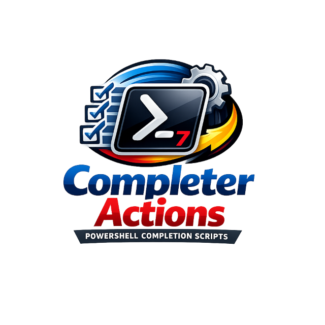

# CompleterActions

<p align="center">
    
</p>

<p align="center"><strong>PowerShell completion scripts for managed registrations, runtime discovery, and safe removal.</strong></p>

<p align="center">
    <a href="https://github.com/tstager/CompleterActions/actions/workflows/ci.yml"></a>
    <a href="https://learn.microsoft.com/powershell/"></a>
    <a href="https://learn.microsoft.com/powershell/scripting/install/powershell-core-support"></a>
    <a href="LICENSE.md"></a>
</p>

`CompleterActions` is a PowerShell 7+ / Core-only module for registering, discovering, querying, and removing PowerShell argument completers in a consistent way.

> [!IMPORTANT]
> This module targets **PowerShell 7.4+ / PowerShell Core only**. The manifest declares `CompatiblePSEditions = @('Core')` and `PowerShellVersion = '7.4'`.

## At a glance

- Manage both parameter completers and native command completers
- Import completer scripts into managed registration input objects through a strict grammar or, for scripts you own, a trusted tier
- Describe a whole completer repository in one set file, validate it up front, and register it with a single command
- Check completer scripts against the strict grammar and get findings with line numbers and fix hints
- Verify a registration by running tab completion for an input and getting the matches back as objects
- Query module-managed registrations and runtime-discovered registrations
- Remove managed registrations cleanly from both runtime and module state
- Require explicit opt-in before removing unmanaged runtime registrations
- Return rich registration objects with default table formatting
- Support property-name pipeline binding and paging for discovery scenarios

## Command map

| Command | What it does |
| --- | --- |
| `Export-CompleterSet` | Writes a completer set file (`.psd1`) from registrations that came from scripts, with each script's trust tier and targets |
| `Get-Completer` | Lists completer registrations known to the module or discovered from the current runtime, filtered by `-State` and sorted by type, command, and parameter |
| `Import-CompleterScript` | Converts standalone completer scripts into objects that can be piped to `Register-Completer -InputObject`; strict grammar by default, `-Trusted` to run the script as-is |
| `Import-CompleterSet` | Validates every entry of a completer set up front, then registers the whole set lazily; `-SkipInvalid` warns and registers the rest |
| `New-CompleterScript` | Writes a completer script skeleton for a native command, with a subcommand table read from its help, that passes `Test-CompleterScript` as written |
| `Register-Completer` | Registers a managed completer and records it in module state; `-Path -Lazy` registers a completer script that loads on its first tab press |
| `Reset-Completer` | Returns a Failed or Active script-backed completer to Pending so its script loads again on the next tab press |
| `Test-CompleterRegistration` | Runs tab completion for an input against a registered target and returns the completion matches |
| `Test-CompleterScript` | Checks completer scripts against the strict import grammar and returns findings with line, column, construct, and a fix hint |
| `Test-CompleterSet` | Reports drift between a completer set file and the scripts on disk as findings; empty when the set matches |
| `Unregister-Completer` | Removes completer registrations from runtime and, when applicable, from module state |

`Get-CompleterRegistration`, `Register-CompleterRegistration`, and `Unregister-CompleterRegistration` remain as aliases of the renamed commands until 3.0; the first call to each in a process writes a deprecation warning. `about_CompleterActions_Migration` covers the move from 1.x.

## Start here

### Install from the gallery

```powershell
Install-PSResource -Name CompleterActions
Import-Module CompleterActions
```

### Import from the repository during development

```powershell
Import-Module .\CompleterActions.psd1
```

### Import the built module output

```powershell
Import-Module .\build\CompleterActions\CompleterActions.psd1
```

### Read the conceptual guides

```powershell
Get-Help about_Import_Completers
Get-Help about_Completer_Sets
Get-Help about_CompleterActions_Migration
```

Runtime registration discovery and unmanaged-registration removal depend on PowerShell runtime internals. The module is tested on PowerShell 7, but future engine changes may require maintenance in that discovery path.

## Typical flow

1. Scaffold a completer: for a new script, `New-CompleterScript -CommandName <tool> -Path .\<tool>_completer.ps1` writes a skeleton whose subcommand table is read from the tool's help.
2. Check an existing completer script with `Test-CompleterScript`, or decide to import it with `-Trusted`.
3. Register a completer directly, or import the script into managed input objects.
4. Verify the registration with `Test-CompleterRegistration` and inspect it with `Get-Completer`.
5. Replace or remove registrations when the target changes.
6. Use `-AllowUnmanaged` only when removing runtime registrations that were not created by the module.

## Examples

### Register a parameter completer

```powershell
function Invoke-DemoTool {
    [CmdletBinding()]
    param(
        [string] $Name
    )
}

$scriptBlock = {
    param($commandName, $parameterName, $wordToComplete, $commandAst, $fakeBoundParameters)

    'alpha', 'beta', 'gamma' |
        Where-Object { $_ -like "$wordToComplete*" } |
        ForEach-Object {
            [System.Management.Automation.CompletionResult]::new($_, $_, 'ParameterValue', $_)
        }
}

Register-Completer -CommandName Invoke-DemoTool -ParameterName Name -ScriptBlock $scriptBlock
```

### Register a native completer

```powershell
$nativeScriptBlock = {
    param($wordToComplete, $commandAst, $cursorPosition)

    'status', 'switch', 'sync' |
        Where-Object { $_ -like "$wordToComplete*" } |
        ForEach-Object {
            [System.Management.Automation.CompletionResult]::new($_, $_, 'ParameterValue', $_)
        }
}

Register-Completer -CommandName demoexe -Native -ScriptBlock $nativeScriptBlock
```

### Import an existing completer script

```powershell
Import-CompleterScript -Path .\7z_completer.ps1 |
    Register-Completer -PassThru
```

### Check a completer script before importing it

```powershell
# One script: findings with line, column, construct, message, and hint
Test-CompleterScript -Path .\7z_completer.ps1

# A whole repository: empty when every script conforms
Get-ChildItem -Path ~\Completers -Recurse -Filter *.ps1 |
    Test-CompleterScript |
    Where-Object Severity -eq Error
```

### Import a script you own with the trusted tier

```powershell
Import-CompleterScript -Path .\git_completer.ps1 -Trusted |
    Register-Completer
```

### Register a script lazily

```powershell
# Strict tier: the targets are read from the script, which runs on the first tab press
Register-Completer -Path .\7z_completer.ps1 -Lazy

# Trusted tier: name the targets, because a trusted script is not parsed
Register-Completer -Path .\git_completer.ps1 -Lazy -Trusted -CommandName git, git.exe -Native

# Pending until the first tab press; Failed, with LoadError, if the script did not load
Get-Completer -State Pending, Failed
```

### Describe a completer repository as a set

```powershell
# Build the set once, without registering anything in this session
Get-ChildItem ~\Completers -Recurse -Filter *_completer.ps1 |
    Import-CompleterScript |
    Export-CompleterSet -Path ~\Completers\completers.psd1

# The profile then needs one line
Import-CompleterSet -Path ~\Completers\completers.psd1
```

### Verify a registration

```powershell
Test-CompleterRegistration -CommandName git -Native -InputText 'git che'

Get-Completer -CommandName Invoke-DemoTool -ParameterName Name |
    Test-CompleterRegistration -InputText 'Invoke-DemoTool -Name a'
```

### Query registrations

```powershell
# All known registrations
Get-Completer

# A specific native completer
Get-Completer -CommandName git -Native

# A specific parameter completer
Get-Completer -CommandName Invoke-DemoTool -ParameterName Name

# Only module-managed registrations
Get-Completer -State Active, Pending, Failed, Stale

# Registrations made outside the module, and live values that replaced a managed one
Get-Completer -State Discovered, Conflicted

# Lazy registrations that have not loaded or failed to load
Get-Completer -State Pending, Failed
```

### Replace an existing registration

```powershell
Register-Completer `
    -CommandName Invoke-DemoTool `
    -ParameterName Name `
    -ScriptBlock $scriptBlock `
    -Force
```

### Unregister registrations

```powershell
# Remove a managed registration
Unregister-Completer -CommandName Invoke-DemoTool -ParameterName Name -Confirm:$false

# Remove by piping a registration record back in
Get-Completer -CommandName demoexe -Native |
    Unregister-Completer -Confirm:$false

# Remove a runtime-only registration explicitly
Unregister-Completer `
    -CommandName SomeTool `
    -ParameterName Name `
    -AllowUnmanaged `
    -Confirm:$false
```

## Lazy loading and completer sets

A completer set is a `.psd1` data file that lists completer scripts, the trust tier each one loads under, and the targets each one registers:

```powershell
@{
    Version = 1
    Entries = @(
        @{
            Path    = 'git_completer.ps1'
            Trusted = $false
            Targets = @(
                @{ CommandName = 'git'; Native = $true }
            )
        }
    )
}
```

`Import-CompleterSet` reads the file with `Import-PowerShellDataFile`, so the set itself can never run code, and validates every entry before registering anything: the file exists and is a `.ps1`, `Trusted` entries declare their `Targets`, strict entries name their targets with literal `Register-ArgumentCompleter` arguments so they can be derived from the parsed script and compared against any the entry declares, no target is listed by two entries, and without `-Force` no target already carries a managed or runtime registration for a different completer. The strict grammar itself runs when a script loads, not at import: importing a set parses each strict script once, unless the entry's `Hash` matches, to validate the entry, registers the targets that parse derived, and walks none of them; a script that fails the grammar moves to `Failed` on its first tab press. One error lists every problem; `-SkipInvalid` turns them into warnings and registers the rest. `Export-CompleterSet` writes a `Hash` on every entry, the SHA-256 of the script's text with its line endings normalised, and a strict entry that declares `Targets` and whose `Hash` still matches its script registers those `Targets` without the parse; `Test-CompleterSet` reports every entry whose `Hash` is missing or stale along with any other drift between the set and its folder, and returns nothing when they match.

Registering a set does not run the scripts. Each target gets a stub and a managed record in state `Pending`; the first tab press for that target loads the script, swaps in the real completer, and moves the record to `Active`. A script that fails to load yields no completions for that press, records the error as `LoadError` with state `Failed`, and removes its stub so PowerShell's default completion takes over; once the script is fixed, `Get-Completer -State Failed | Reset-Completer` returns the record to `Pending` so the next tab press loads it again. Nothing the module does hooks PSReadLine key handlers, replaces `TabExpansion2`, or changes PSReadLine options. `about_Completer_Sets` covers the schema and lifecycle in full, and `tools/Measure-CompleterStartup.ps1` measures the eager and lazy startup cost of a completer repository in child `pwsh -NoProfile` processes, with `-BaselineModulePath` adding a same-run comparison against another package such as 2.0.0. On a 173-script, 366-target repository (ten interleaved samples per leg) the eager `Import-CompleterScript | Register-Completer` pipeline takes a median 8847.9 ms, 2.0.0's `Import-CompleterSet` 1589.6 ms, and this version's `Import-CompleterSet` 862.9 ms for a set whose entries carry a matching `Hash`, a ratio of 0.54 against 2.0.0 that misses the roadmap target of 0.50; the same set without `Hash` takes 1423.9 ms. A set registers as one transaction: its entries are validated and written against one snapshot of the session's registrations, and if any write fails every change the set made is rolled back.

## Output, formatting, paging, and pipeline support

Registration records use the `CompleterActions.CompleterRegistration` type and have a default table view with:

- `Command`
- `Parameter`
- `Type`
- `Source`
- `State`
- `ScriptPath`
- `LoadError`

`State` is a `CompleterState` enum. It is `Active` for managed records whose stored script is the live runtime value and `Discovered` for live values that no managed record describes. If another caller replaces or removes a managed target with the built-in `Register-ArgumentCompleter`, the managed record becomes `Stale`: `Get-Completer` returns it alongside the live value as `Conflicted`, `Register-Completer` requires `-Force` to reconcile, and `Unregister-Completer` requires `-AllowUnmanaged` before it removes the live value together with the stale record. A lazy registration is `Pending` until its script loads on the first tab press. If that load fails, the press returns no completions and default completion applies exactly as with no completer registered; the record becomes `Failed` with the message in `LoadError`, its runtime entry is removed, and `Register-Completer -Force` or `Reset-Completer` retries. `ScriptPath` names the completer script behind a lazy or imported registration. Lazy loading runs inside the ordinary completer call and never touches PSReadLine key handlers, `TabExpansion2`, or PSReadLine options.

`Test-CompleterScript` returns `CompleterActions.CompleterScriptFinding` records shown as a list grouped by script path, with `Line`, `Column`, `Severity`, `Construct`, `Message`, and `Hint`. A conforming script returns nothing. `Test-CompleterRegistration` returns `CompleterActions.CompletionMatch` records shown as a table grouped by target key, with `CompletionText`, `ListItemText`, `ResultType`, and `ToolTip`.

`Get-Completer -State` selects any set of states, and the output is sorted by `CompleterType`, `CommandName`, and `ParameterName` before the PowerShell paging parameters apply, so you can do things like:

```powershell
Get-Completer -State Active, Discovered -First 10
Get-Completer -Skip 10 -First 10 -IncludeTotalCount
```

Pipeline highlights:

- `Get-Completer` accepts registration records from `Get-Completer` and `Import-CompleterScript` through `InputObject`, which binds every piped object by value; an input object describes one target, and arrays go to `-CommandName` and `-ParameterName`. Keys are output-only identifiers and are never accepted as typed input
- `Import-CompleterScript` emits input objects that are ready for `Register-Completer -InputObject`
- `Export-CompleterSet` accepts records from `Get-Completer` and `Import-CompleterScript`; `Import-CompleterSet` accepts `Get-ChildItem` output through `FullName` binding
- `Test-CompleterScript` accepts `Get-ChildItem` output directly through `FullName` binding
- `Test-CompleterRegistration` accepts registration records from `Get-Completer` and `Import-CompleterScript`
- `Register-Completer` can accept input objects that describe a target and expose a `ScriptBlock`
- `Unregister-Completer` can accept pipeline input directly from `Get-Completer`

Example:

```powershell
Get-Completer -State Active, Pending, Failed, Stale |
    Unregister-Completer -Confirm:$false
```

## Build, test, and lint

### Build

The repository uses `Invoke-Build` and the dotnet SDK 8.0 or later, which compiles the C# project under `src\Core` into `CompleterActions.Core.dll`.

```powershell
Invoke-Build -Task clean
Invoke-Build -Task compile
Invoke-Build -Task build
Invoke-Build -Task external_help
Invoke-Build -Task Markdown_templates
Invoke-Build -Task ?
```

`compile` builds the assembly and copies it to `lib\CompleterActions.Core.dll`, where the source manifest's `RequiredAssemblies` entry finds it, so `Import-Module .\CompleterActions.psd1` works only after it has run. When the tracked package `build\CompleterActions` exists, `compile` also copies the assembly to `build\CompleterActions\lib\CompleterActions.Core.dll`, so the packaged module imports before a full build. `build` runs `compile` first and places the assembly at `build\CompleterActions\lib\CompleterActions.Core.dll`. The assembly is not tracked in git; neither are `lib\`, `build\CompleterActions\lib\`, or the project's `bin\` and `obj\` folders. An assembly cannot be unloaded, so a rebuilt `CompleterActions.Core.dll` needs a new `pwsh` process, and a process that has the repository's module imported holds the file open and makes `clean` and `compile` fail on Windows.

### Tests

The repository uses `Pester`.

```powershell
Invoke-Build -Task compile
Invoke-Pester -Path .\tests
```

`Invoke-Build -Task compile` or `Invoke-Build -Task build` must run first: `Import-Module` of the source manifest and `Test-ModuleManifest` both fail without `lib\CompleterActions.Core.dll`.

Run the tests in their own `pwsh -NoProfile` process. Importing PSScriptAnalyzer into the same session registers an argument completer that changes the discovered registration order the paging tests assert on. The tests also compare the tracked `build\CompleterActions` package against the sources, so run them before `Invoke-Build -Task build`, which regenerates that package.

### Linting

The repository includes `PSScriptAnalyzerSettings.psd1`. CI runs the same two commands.

```powershell
Invoke-ScriptAnalyzer -Path .\src -Recurse -Settings .\PSScriptAnalyzerSettings.psd1
Invoke-ScriptAnalyzer -Path .\tests -Recurse -Settings .\PSScriptAnalyzerSettings.psd1
```

## Releasing

Once per repository, add a PowerShell Gallery API key as the `GALLERY_API_KEY` secret under Settings > Secrets and variables > Actions.

Each release is then a tag push:

```powershell
# bump ModuleVersion in CompleterActions.psd1, move the Unreleased CHANGELOG entries
# under the new version heading, then regenerate and commit the packaged build
Invoke-Build -Task build
git commit -am 'chore(release): bump module version to X.Y.Z'
git tag vX.Y.Z
git push origin main vX.Y.Z
```

The tag push runs `release_check`, `build`, the Pester suite, `Publish_build`, and finally creates the GitHub release. The tag must equal `v` plus `ModuleVersion` or `release_check` throws before anything is published.

## Architecture notes

- `CompleterActions.psd1` is the root manifest and defines the exported functions and aliases, formatting file, and PowerShell/Core compatibility.
- `CompleterActions.psm1` is a lightweight root loader that dot-sources `src\Classes` (as one script block, so the classes can reference each other), then `src\Private` and `src\Public`, runs `src\Bootstrap.ps1`, and exports the public function set.
- `src\Bootstrap.ps1` holds the import-time work shared by the source root module and the packaged module: the runtime capability probe, module state initialization, and the three legacy aliases. The build appends it to the packaged `.psm1` after the function definitions.
- `src\Classes` defines the record classes (`CompleterRegistration`, `ImportedCompleterRegistration`, `CompleterScriptFinding`, `CompletionMatch`) and the `CompleterState` and `CompleterType` enums. Each class inserts its dotted `PSTypeName` in the constructor, which stays the contract the format file and consumers rely on.
- `src\Public` contains the user-facing command surface:
  - `Export-CompleterSet`
  - `Get-Completer`
  - `Import-CompleterScript`
  - `Import-CompleterSet`
  - `Register-Completer`
  - `Test-CompleterRegistration`
  - `Test-CompleterScript`
  - `Unregister-Completer`
  - the exported legacy wrappers `Get-CompleterRegistrationLegacy`, `Register-CompleterRegistrationLegacy`, and `Unregister-CompleterRegistrationLegacy` behind the three aliases
- `src\Private` contains the runtime and state helpers that resolve targets, manage the module registration table, and inspect or remove runtime registrations. The strict import grammar lives in `Test-CompleterScriptAst`, which returns `CompleterActions.CompleterScriptFinding` records that both `Test-CompleterScript` and `Import-CompleterScript` consume. Completer sets are read by `Import-CompleterSetDefinition` and validated entry by entry in `Resolve-CompleterSetEntry` (with `Get-CompleterScriptTarget` deriving strict-tier targets from the AST) against one `Get-CompleterRegistrationSnapshot` of the session; `Register-Completer` and `Import-CompleterSet` both resolve conflicts through `Resolve-CompleterRegistrationConflict` and write through `Add-CompleterRegistration`, which writes a batch as one transaction: a whole set for `Import-CompleterSet`, one target at a time for `Register-Completer`.
- `tools\Measure-CompleterStartup.ps1` is the startup benchmark: eager import versus `Import-CompleterSet`, each sampled in fresh `pwsh -NoProfile` processes.

### Runtime internals caveat

The module discovers live completer registrations by reflecting into PowerShell runtime internals to access the underlying completer dictionaries. That makes the current implementation practical and useful, but it also means runtime discovery depends on non-public engine details and may need maintenance if PowerShell internals change in a future release.

`Assert-CompleterRuntimeCapability` resolves every reflected member once during import. On an engine whose internals have changed, `Import-Module` fails with a single error that names the running PowerShell version and the members that could not be resolved, instead of a later `Get` or `Register` call failing deep inside the module.

## Development notes

- Managed registrations are tracked in module state for the current session.
- Runtime-discovered registrations can be queried even if they were not created by this module.
- Discovery covers the two target kinds the module manages, command-parameter and native completers. A completer registered with `Register-ArgumentCompleter -ParameterName` alone, without `-CommandName`, is stored under the bare parameter name; it is skipped with a verbose message rather than failing the query, and it is never resolved as a native target of the same name.
- Removal of unmanaged runtime registrations is intentionally gated behind `-AllowUnmanaged`.
